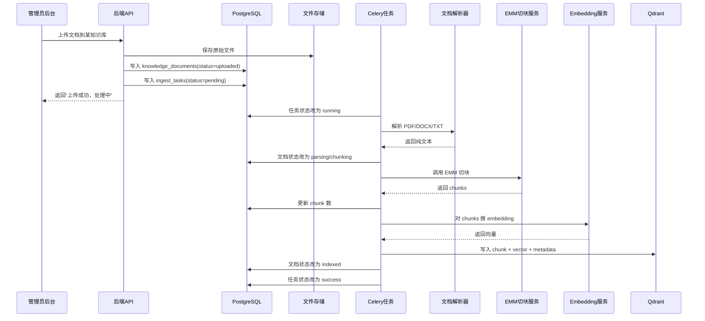
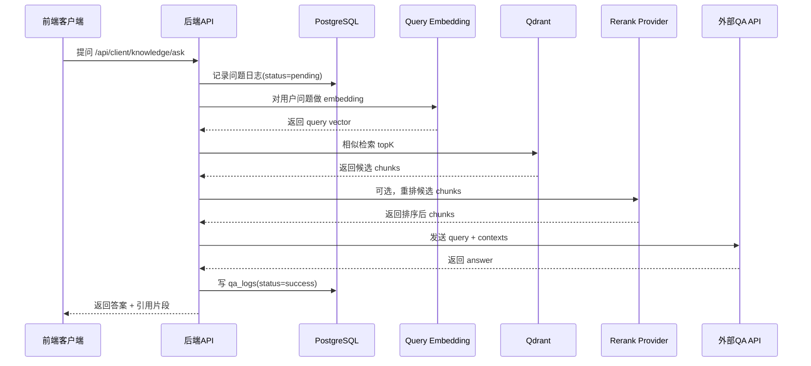

# 知识库上传到问答返回的完整时序图

这份文档回答两个问题：
- 知识库是怎么被处理的
- 用户提问后答案是怎么回来的

## 1. 文档上传链路



## 2. 用户问答链路



## 3. 如果没有 rerank

那就走这条：

```text
query -> embedding -> qdrant检索 -> 直接发QA API -> 返回答案
```

系统也能正常工作，只是命中精度可能差一点。

## 4. 失败时会卡在哪

上传链路可能失败点：
- 文档解析失败
- EMM 切块服务失败
- embedding 失败
- Qdrant 写入失败

问答链路可能失败点：
- query embedding 失败
- Qdrant 检索失败
- 外部 QA API 超时
- rerank API 失败

所以后台一定要把失败点显示出来，不然你根本查不动。

## 5. 小白版理解

你可以把上传流程理解成：

1. 先把书放进仓库
2. 把书拆成小段
3. 给每一段编号和做向量
4. 放进检索仓库

把问答流程理解成：

1. 用户提问题
2. 系统先去仓库里找相关段落
3. 找到后交给外部大模型整理成一句完整回答

所以你的服务器主要是在“找资料”，不是在“自己当大模型回答一切”。
