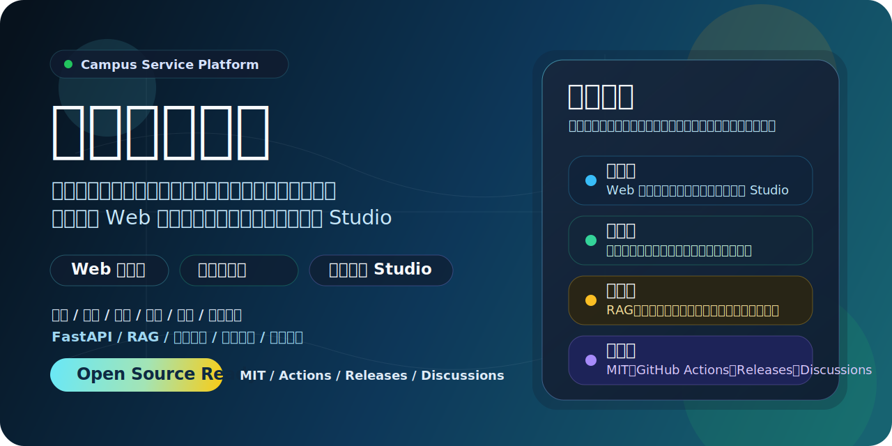
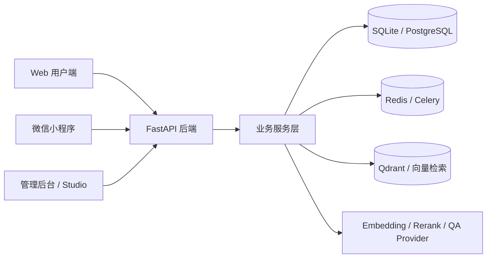

# 校园智服平台

<p align="center">
  
</p>

<p align="center">
  
  
  
  
</p>

> 一个围绕高校校园场景构建的综合服务项目，整合了用户端 Web、管理后台、FastAPI 后端、知识库问答链路，以及微信小程序客户端。

## 项目亮点

- 校园社区内容流：发帖、评论、点赞、收藏、消息提醒
- 校园服务场景：跑腿任务、个人主页、搜索与消息列表
- 校园知识库问答：支持文档导入、切块、Embedding、检索、引用回溯
- 管理端运营工具：知识库管理、文档上传、任务追踪、配置调试、日志查看
- 多端协同：Web 用户端、后台管理端、微信小程序共用一套核心后端

## 适合什么场景

- 高校校园综合服务平台
- 校园知识库问答与信息检索
- 校园社区、跑腿、通知、互动类产品原型
- 面向毕业设计、课程项目、校园数字化探索的落地型项目

## 系统架构



## 功能地图

| 模块 | 说明 | 关键目录 |
| --- | --- | --- |
| Web 用户端 | 校园社区、搜索、问答、互动页面 | `index.html` `app.js` `styles.css` |
| 后端 API | 用户端接口、管理端接口、认证、任务、服务编排 | `backend/app/` |
| RAG 问答链路 | 文档解析、切块、向量化、检索、问答 | `backend/app/rag/` `backend/app/services/` |
| 管理后台 | 知识库上传、任务重试、配置与日志查看 | `backend/app/static/studio/` |
| 微信小程序 | 校园业务移动端入口 | `wechat-miniprogram/` |
| 自动化测试 | E2E 与接口级回归 | `backend/tests/` `e2e/` |

## 仓库结构

```text
.
|- backend/                  # FastAPI 后端、管理接口、RAG 链路、测试脚本
|- wechat-miniprogram/       # 微信小程序客户端
|- e2e/                      # Playwright 端到端脚本
|- docs/assets/              # GitHub 展示资源
|- index.html                # Web 用户端入口
|- app.js                    # Web 用户端核心逻辑
|- styles.css                # Web 用户端样式
|- CONTRIBUTING.md           # 贡献说明
|- SECURITY.md               # 安全披露说明
`- LICENSE                   # 开源许可证
```

## 快速开始

### 1. 准备环境

- Python 3.11+
- Node.js 18+
- Windows PowerShell 或等价终端
- 可选：Redis、Qdrant、外部模型服务

### 2. 克隆并安装依赖

```powershell
git clone https://github.com/86Kolton/campus-smart-service.git
cd campus-smart-service
python -m venv .venv
.\.venv\Scripts\python.exe -m pip install -r .\backend\requirements.txt
```

### 3. 配置后端环境变量

```powershell
Copy-Item .\backend\.env.example .\backend\.env
```

然后按需填写：

- `ADMIN_USERNAME`
- `ADMIN_PASSWORD`
- `JWT_SECRET`
- `QA_*`
- `EMBEDDING_*`
- `RERANK_*`
- `WECHAT_*`

### 4. 启动后端

```powershell
.\backend\start_backend.ps1
```

或在项目根目录一键拉起本地联调栈：

```powershell
.\start_local_stack.ps1 -Restart
```

### 5. 运行测试

```powershell
.\backend\run_tests.ps1
```

### 6. 导入微信小程序

- 打开微信开发者工具
- 选择 `wechat-miniprogram/`
- 使用自己的 AppID 或测试号导入
- 配置合法域名与 API 地址

## 开发说明

### Web 用户端

- 入口文件：`index.html`
- 交互逻辑：`app.js`
- 样式文件：`styles.css`

### 后端

- API 路由：`backend/app/api/`
- 业务服务：`backend/app/services/`
- 配置与安全：`backend/app/core/`
- 数据模型：`backend/app/models/`
- RAG 链路：`backend/app/rag/`

### 小程序

- 页面：`wechat-miniprogram/pages/`
- 配置：`wechat-miniprogram/config/env.js`
- 通用请求与鉴权：`wechat-miniprogram/utils/`

## 公共仓库边界

这个公开仓库只保留：

- 源代码
- 示例知识库数据
- 开发与测试脚本
- GitHub 展示与协作说明

这个公开仓库不会保留：

- 真实 `backend/.env`
- 生产数据库
- 上传文件与私有运行数据
- 私有运维恢复资料
- 服务器密码、API Key、私有证书

## 当前开源补充

- `LICENSE`：采用 MIT License
- `CONTRIBUTING.md`：补充协作规范
- `SECURITY.md`：补充安全披露流程
- GitHub 仓库已设置公开描述与主题标签

## 后续可扩展方向

- 增加 Docker 一键开发环境与生产部署模板
- 增加 GitHub Actions 自动化测试
- 增加截图、演示 GIF 和版本发布说明
- 将 Web 端拆分为更清晰的模块结构
- 将管理后台和用户端前端逐步组件化

## 相关文档

- [backend/README.md](backend/README.md)
- [wechat-miniprogram/README.md](wechat-miniprogram/README.md)
- [ADMIN_BEGINNER_GUIDE.md](ADMIN_BEGINNER_GUIDE.md)
- [API_CONTRACT.md](API_CONTRACT.md)

## 贡献与安全

- 贡献流程见 [CONTRIBUTING.md](CONTRIBUTING.md)
- 安全问题披露见 [SECURITY.md](SECURITY.md)

## 许可证

本项目采用 [MIT License](LICENSE) 开源。
